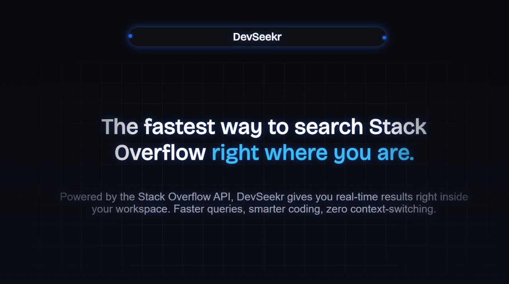

# DevSeekr 🔍💻

**DevSeekr** is a smart and clean tool built for developers to quickly search and find solutions from Stack Overflow. Whether you're stuck with an error or just exploring, DevSeekr helps you get the right answers faster.

---

## 🚀 Features

- 🔎 Search for coding questions directly
- 📡 Stack Exchange API integration
- 💡 Clean and minimal UI
- ⚛️ Built using React JS

## 🛠 Tech Stack

- React JS
- Stack Exchange API

 

## 📸 Preview

---

## 📡 Live Demo

- https://devseekr.vercel.app/

## 🔮 Future Updates

- ✅ Make the website fully responsive for all screen sizes
- 🔐 Add user Login and Sign Up functionality
- 💾 Store user search history and activity data
- - 📈 Add stats or insights based on user searches
- 💬 Allow users to comment or bookmark answers

